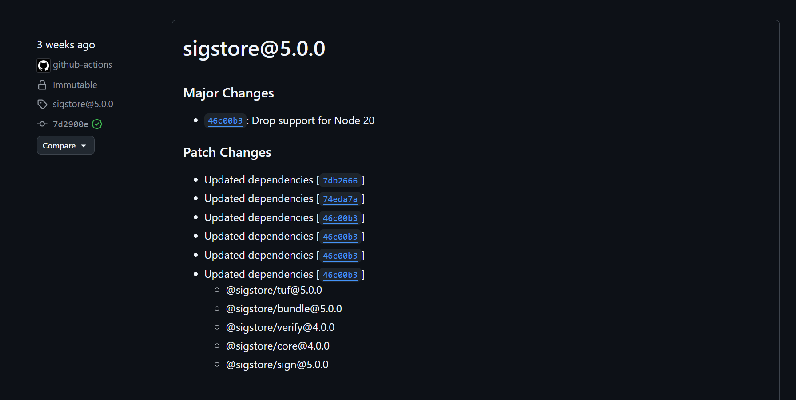

# 2026-06-21 자료 : 스파이크 확인

구분: 자료(조사)
진행일: 2026년 6월 21일
생성자: 김민재
생성 일시: 2026년 6월 21일 오후 6:16

1. 정상 패키지 (sigstore)

① attestation: 

[registry.npmjs.org/-/npm/v1/attestations/](http://registry.npmjs.org/-/npm/v1/attestations/)<pkg>@<ver>

여기에서 <pkg> 와 <ver>은 각각 패키지 이름과 버전을 의미한다.

난 sigstore 패키지의 5.0.0 버전을 선택했으니

[`https://registry.npmjs.org/-/npm/v1/attestations/sigstore@5.0.0`](https://registry.npmjs.org/-/npm/v1/attestations/sigstore@5.0.0)

를 주소창에 입력하였고, json안에 의미 있는 데이터가 들어있는걸 확인 가능

② 커밋→PR : 

[api.github.com/repos/](http://api.github.com/repos/)<o>/<r>/commits/<sha>/pulls

여기서 <o>는 Owner=sigstore <r>은 Repository= sigstore-js 이고, sha가 필요하다.



sha를 구하기 위해  46c00b3 커밋 버전을 선택하였고, 커밋링크를 누르면

[`https://github.com/sigstore/sigstore-js/commit/46c00b388b376a4baef94e5acf300bb173dd3702`](https://github.com/sigstore/sigstore-js/commit/46c00b388b376a4baef94e5acf300bb173dd3702) 

라는 url로 이동하게 되고, 이 주소창에서 `46c00b388b376a4baef94e5acf300bb173dd3702` 라는 전체 SHA 40자를 확인할 수 있다.

이제 [`https://api.github.com/repos/sigstore/sigstore-js/commits/46c00b388b376a4baef94e5acf300bb173dd3702/pulls`](https://api.github.com/repos/sigstore/sigstore-js/commits/46c00b388b376a4baef94e5acf300bb173dd3702/pulls) 를 주소창에 입력.


그 결과 여러 정보가 보이는데, 10행에 있는 numbr:1670이 바로 PR번호이다.

③ PR→리뷰어 :

 `[api.github.com/repos/](http://api.github.com/repos/)<o>/<r>/pulls/<n>/reviews` 

여기서 <n>이 앞서 구한 PR번호를 의미하므로, PR번호인 1670을 넣고 입력한다.

입력한 URL: [h`ttps://api.github.com/repos/sigstore/sigstore-js/pulls/1670/reviews`](https://api.github.com/repos/sigstore/sigstore-js/pulls/1670/reviews)

```json
[
  {
    "id": 4404612959,
    "node_id": "PRR_kwDOHYneG88AAAABBokPXw",
    "user": {
      "login": "ejahnGithub",
      "id": 108841108,
      "node_id": "U_kgDOBnzIlA",
      "avatar_url": "https://avatars.githubusercontent.com/u/108841108?u=16be006a929b81c257f41ad5ec35a51a79fab66b&v=4",
      "gravatar_id": "",
      "url": "https://api.github.com/users/ejahnGithub",
      "html_url": "https://github.com/ejahnGithub",
      "followers_url": "https://api.github.com/users/ejahnGithub/followers",
      "following_url": "https://api.github.com/users/ejahnGithub/following{/other_user}",
      "gists_url": "https://api.github.com/users/ejahnGithub/gists{/gist_id}",
      "starred_url": "https://api.github.com/users/ejahnGithub/starred{/owner}{/repo}",
      "subscriptions_url": "https://api.github.com/users/ejahnGithub/subscriptions",
      "organizations_url": "https://api.github.com/users/ejahnGithub/orgs",
      "repos_url": "https://api.github.com/users/ejahnGithub/repos",
      "events_url": "https://api.github.com/users/ejahnGithub/events{/privacy}",
      "received_events_url": "https://api.github.com/users/ejahnGithub/received_events",
      "type": "User",
      "user_view_type": "public",
      "site_admin": true
    },
    "body": "LGTM!",
    "state": "APPROVED",
    "html_url": "https://github.com/sigstore/sigstore-js/pull/1670#pullrequestreview-4404612959",
    "pull_request_url": "https://api.github.com/repos/sigstore/sigstore-js/pulls/1670",
    "author_association": "COLLABORATOR",
    "_links": {
      "html": {
        "href": "https://github.com/sigstore/sigstore-js/pull/1670#pullrequestreview-4404612959"
      },
      "pull_request": {
        "href": "https://api.github.com/repos/sigstore/sigstore-js/pulls/1670"
      }
    },
    "submitted_at": "2026-06-01T20:50:36Z",
    "commit_id": "6a5d7f753681b2b61fd2f0bd9db7ddce365aae13"
  }
]
```

이런 내용들이 보이게 되고, 

**확인된 내용:**

- 리뷰어: `ejahnGithub`
- 리뷰 상태: `APPROVED`
- 리뷰 코멘트: "LGTM!"
- 리뷰 시각: `2026-06-01T20:50:36Z`
- 작성자 관계: `COLLABORATOR` (협업자/메인테이너)

결과적으로 JSON 데이터가 성공적으로 반환되었다는걸 확인 가능하다.

④ 브랜치 정책 :

[`https://api.github.com/repos/sigstore/sigstore-js/rules/branches/main`](https://api.github.com/repos/sigstore/sigstore-js/rules/branches/main)

owner와 레포 이름 입력하고 바로 이동.


??? 빈 배열이 나온다.

이 레포는 GitHub의 신규 Repository Rules(Rulesets) 기능으로 등록된 main 브랜치 규칙이 없다는 뜻이다.

따라서 데이터 없음 → 이 API 자체는 "작동"하지만(에러 아님), "정상적으로 빈 결과를 돌려줌"이라 
스파이크 목적상 "조회 가능은 한데, 이 레포엔 데이터가 없다” 라는 결론을 냈다.

⑤ 워크플로 이력:

[`https://api.github.com/repos/sigstore/sigstore-js/commits?path=.github/workflows/release.yml`](https://api.github.com/repos/sigstore/sigstore-js/commits?path=.github/workflows/release.yml)


많은 내용이 보이고 확인되는 내용 몇 개만 정리했다.

| 날짜 | 작성자 | 내용 |
| --- | --- | --- |
| 2025-12-19 | `bdehamer` (메인테이너) | "use node 24 in release workflow" |
| 2025-07-29 | `bdehamer` | "Prepare v4 major release" |
| 2025-07-02 | `bdehamer` | **"use npm trusted publishing"** ← 신뢰 게시(OIDC) 방식 도입 시점 |
| 그 외 다수 | `dependabot[bot]` | GitHub Actions 버전 자동 업그레이드 |

결론: `release.yml` 워크플로 파일이 언제, 누가, 왜(커밋 메시지) 바꿨는지 전부 시간순으로 조회 가능

1. 침해된 패키지(TanStack)

침해 패키지 기본 정보:

- 패키지: `@tanstack/react-router`
- 버전: `1.169.8`
- repo: `TanStack/router`

① attestation: 

[`https://registry.npmjs.org/-/npm/v1/attestations/@tanstack/react-router@1.169.8`](https://registry.npmjs.org/-/npm/v1/attestations/@tanstack/react-router@1.169.8) 입력.

`{"error":"Not found"}` 라는 결과가 출력됨.

이 버전 자체가 지금은 npm 레지스트리에서 사라진 상태라서 attestation 조회가 안되는 상황이다.

버전이 사라진게 맞는지 확실하게 확인하기 위해서 1.169.8 버전 정보를 요청하는 url인

 [`https://registry.npmjs.org/@tanstack/react-router/1.169.8`](https://registry.npmjs.org/@tanstack/react-router/1.169.8) 를 입력하였고,

`"version not found: 1.169.8"` 가 출력되는 것으로 보아 버전이 삭제된게 맞음을 확인했다.

결론적으로 npm 공개 API로는 현재 존재하는 패키지의 출처만 추적 가능하고, 삭제된 악성 버전은 추적 불가능하다는 한계를 발견했다.

② 커밋→PR : 

<o>는 TanStack, <r>은 router 이며, sha는 TanStack npm 공급망 침해 사건을 분석한 블로그에서 악성 패키지의 package.json 코드 스니펫을 확인할 수 있었고, 해당 스니펫에 다음과 같이 github 커밋 참조가 포함되어 있었음.


**출처:** [https://www.aikido.dev/blog/mini-shai-hulud-is-back-tanstack-compromised](https://www.aikido.dev/blog/mini-shai-hulud-is-back-tanstack-compromised)

따라서[`https://api.github.com/repos/TanStack/router/commits/79ac49eedf774dd4b0cfa308722bc463cfe5885c/pulls`](https://api.github.com/repos/TanStack/router/commits/79ac49eedf774dd4b0cfa308722bc463cfe5885c/pulls) 를 입력하였고,

```json
{
  "message": "No commit found for SHA: 79ac49eedf774dd4b0cfa308722bc463cfe5885c",
  "documentation_url": "https://docs.github.com/rest/commits/commits#list-pull-requests-associated-with-a-commit",
  "status": "422"
}
```

이러한 결과가 출력되었다.  이 커밋이 현재 `TanStack/router` 저장소에 존재하지 않는다는 뜻으로, 
해커가 메인 저장소에 코드를 직접 커밋한 것이 아니라, 외부 Fork 저장소에서 PR을 보내는 과정의 캐시 포이즈닝(배포 시스템을 속여 물건을 가로채는 수법) 취약점을 악용한 케이스이다. 따라서 해당 악성 커밋의 SHA는 오직 해커의 개인 저장소에만 남고 오리지널 `TanStack/router` 저장소 이력에는 병합되지 않았기 때문에, 메인 저장소를 타깃으로 한 GitHub API 조회 시 커밋을 찾을 수 없다는 422 에러가 반환되는 것이다.

③ PR→리뷰어 :

앞서 2번단계에서 PR번호를 얻었어야 하는데 에러가 났으니 3번실습도 당연히 못함

④ 브랜치 정책 :

[`https://api.github.com/repos/TanStack/router/rules/branches/main`](https://api.github.com/repos/TanStack/router/rules/branches/main)  입력.

```json
[
  {
    "type": "deletion",
    "ruleset_source_type": "Repository",
    "ruleset_source": "TanStack/router",
    "ruleset_id": 16364575
  },
  {
    "type": "non_fast_forward",
    "ruleset_source_type": "Repository",
    "ruleset_source": "TanStack/router",
    "ruleset_id": 16364572
  },
  {
    "type": "pull_request",
    "parameters": {
      "required_approving_review_count": 0,
      "dismiss_stale_reviews_on_push": false,
      "required_reviewers": [

      ],
      "require_code_owner_review": true,
      "require_last_push_approval": false,
      "required_review_thread_resolution": false,
      "allowed_merge_methods": [
        "merge",
        "squash",
        "rebase"
      ]
    },
    "ruleset_source_type": "Repository",
    "ruleset_source": "TanStack/router",
    "ruleset_id": 16364572
  }
]
```

위와 같이 출력된다.

- **`"type": "pull_request"` & `"require_code_owner_review": true`**
    
    코드를 메인 브랜치에 합치려면 **반드시 코드 주인의 리뷰 승인**이 필요하다는 강력한 정책이 켜져 있음.
    
- **`"required_approving_review_count": 0`**
    
    하지만 일반 리뷰어의 필수 승인 개수가 `0`개로 설정되어 있거나, 우회 경로가 완전히 차단되지 않은 허점이 일부 보임.
    

결론적으로 데이터 조회가 가능하므로 침해된 패키지 중에서 처음으로 O가 나왔다.

⑤ 워크플로 이력:

[`https://api.github.com/repos/TanStack/router/commits?path=.github/workflows/release.yml`](https://api.github.com/repos/TanStack/router/commits?path=.github/workflows/release.yml) 입력.


많은 내용 출력 됨

**결과:** 성공, 워크플로 변경 이력 다수 반환

**가장 눈에 띄는 항목들 (사건 직후):**

| 날짜 | 작성자 | 커밋 메시지 |
| --- | --- | --- |
| 2026-05-15 | `birkskyum` (메인테이너) | "ci: align release workflow to query" |
| 2026-05-13 | `Flo` (외부 기여자) | **"ci: zizmor"** ← GitHub Actions 보안 정적분석 도구 도입 |
| 2026-05-12 | `renovate[bot]` | **"chore(deps): pin dependencies"** ← 의존성 버전을 고정(pin)시킴 |

사건 발생일이 5월 11일이고 바로 다음날(5/12)부터 보안 강화 조치가 시작된 게 그대로 보임:

- `pin dependencies` → 더 이상 떠다니는(floating) 버전 참조 금지
- `zizmor` 도입 → GitHub Actions 워크플로 자체를 정적 분석해서 `pull_request_target` 같은 위험 패턴을 자동 탐지하는 도구

결론: 워크플로 변경 이력은 npm 버전 삭제, 커밋 삭제와 무관하게 완전히 추적 가능 → O

최종 비교표:

|  | sigstore (정상) | tanstack (침해) |
| --- | --- | --- |
| ① attestation | O | **X (버전 삭제됨)** |
| ② 커밋→PR | O | **X (커밋 자체가 존재 안 함)** |
| ③ PR→리뷰 | O | - (PR 번호 없어서 시도 불가) |
| ④ 브랜치 정책 | O (데이터는 없음) | O (데이터 있음) |
| ⑤ 워크플로 이력 | O | O (사건 직후 보안 강화 흔적 확인) |