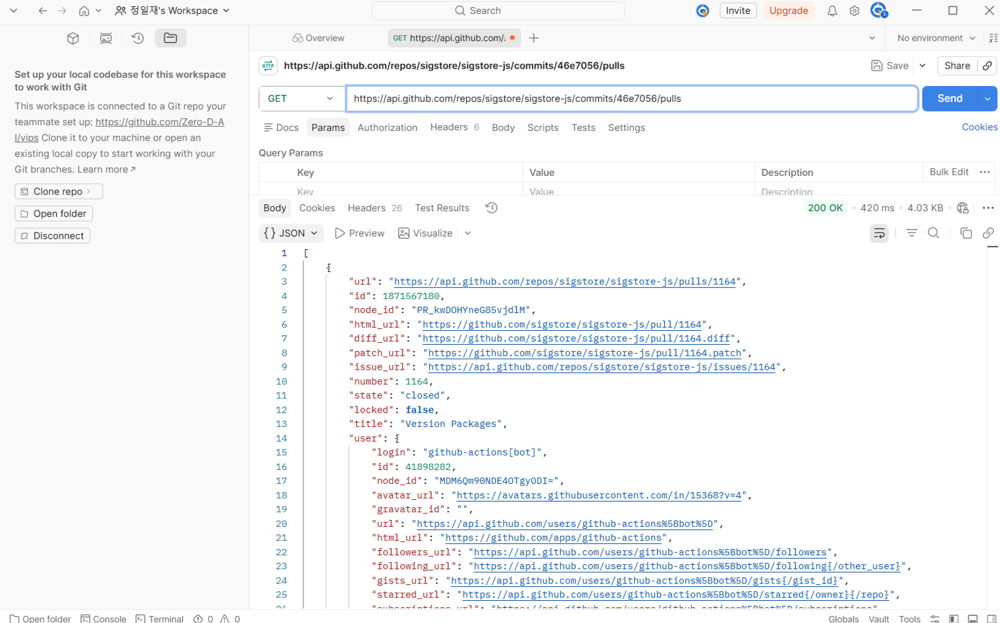
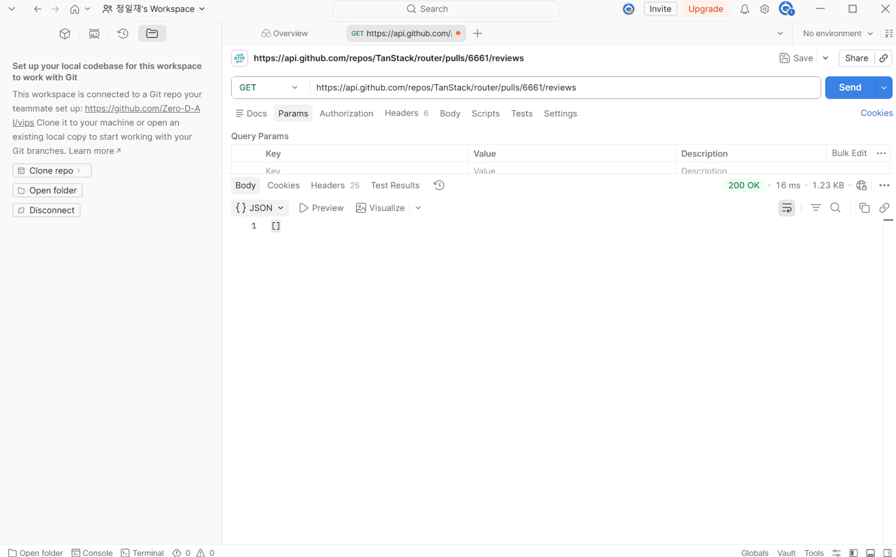
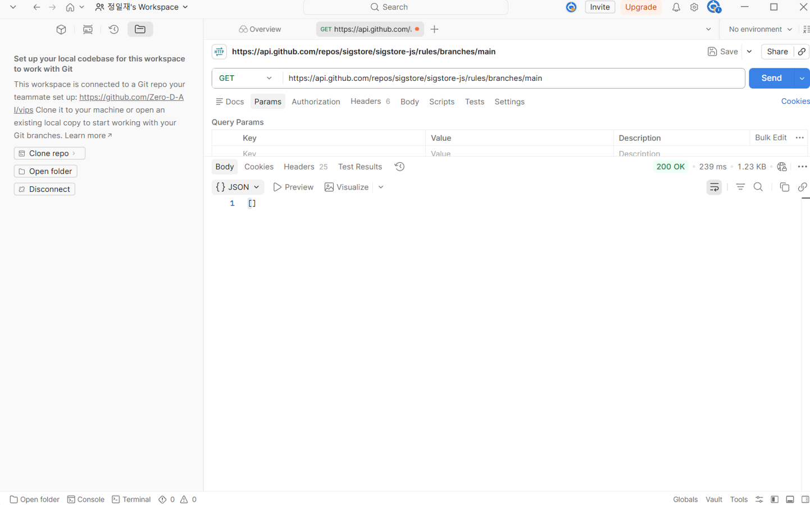
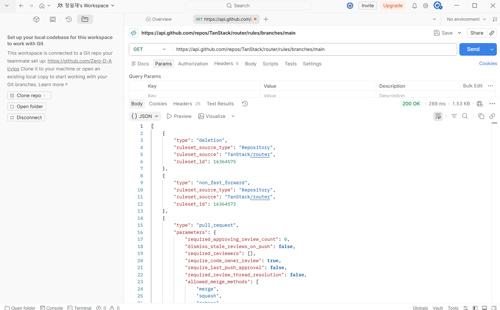
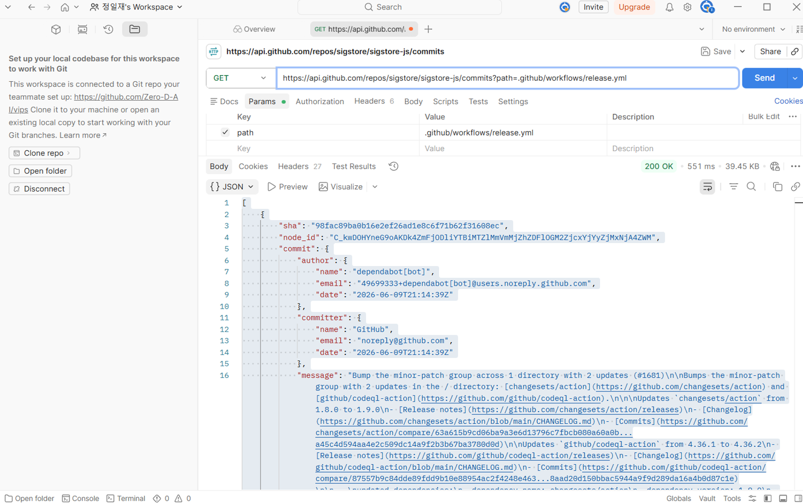

# Spike Report: 외부 패키지 계보 데이터 검증

## 1. 개요

공급망 보안 분석을 위해 외부 패키지의 계보(Provenance) 및 빌드 이력을 공개 API로 추적할 수 있는지 확인하기 위한 기술 검증(Spike)을 수행함.

## 1.1 조사 및 협업 도구

GitHub API 및 Postman: NPM 레지스트리와 GitHub에서 제공하는 공개 REST API 엔드포인트를 호출하고 응답 데이터를 검증하는 핵심 도구로 사용되었습니다.

## 2. 검증 대상

- 정상 패키지: `sigstore@2.3.1` (Provenance 데이터 포함)
- 침해 패키지: `@tanstack/react-router@1.169.5` (공급망 공격 사례)

## 3. 항목별 검증 결과 (10개 항목)

| 순번 | 항목              | 대상 레포지토리        | 결과  | 비고                                            |
| :--- | :---------------- | :--------------------- | :---: | :---------------------------------------------- |
| 1    | **Attestation**   | sigstore               | **O** | 정상: SLSA Provenance 데이터 확보 성공          |
| 2    | **Attestation**   | @tanstack/react-router | **X** | 침해: 404 Not Found (데이터 부재)               |
| 3    | **커밋→PR**       | sigstore/sigstore-js   | **O** | PR 번호 및 머지 이력 확인                       |
| 4    | **커밋→PR**       | TanStack/router        | **X** | 악성 커밋에 대응하는 공식 PR 부재               |
| 5    | **PR→리뷰어**     | sigstore/sigstore-js   | **O** | 협업자(Collaborator)의 승인(APPROVED) 확인      |
| 6    | **PR→리뷰어**     | TanStack/router        | **X** | 리뷰 내역 없음 (`[]`)                           |
| 7    | **브랜치 정책**   | sigstore/sigstore-js   | **X** | 데이터 조회 권한 없음 (403/404)                 |
| 8    | **브랜치 정책**   | TanStack/router        | **O** | 승인 정책 확인 (Approving_review_count: 0 발견) |
| 9    | **워크플로 이력** | sigstore/sigstore-js   | **O** | 봇(Dependabot)에 의한 정기적 업데이트 확인      |
| 10   | **워크플로 이력** | TanStack/router        | **O** | CI 설정 파일 변경 이력 확인                     |

## 4. 분석 논리 및 설계 전환

- 기술적 타당성: 10개 항목 중 7개 항목이 데이터 확보에 성공하여 GO 판정을 내림.
- 보안 식별 지표:
  - 정상 패키지는 '투명성 로그(Attestation) + 리뷰 승인(PR Reviews) + 봇 자동화(Workflows)'라는 강력한 보안 파이프라인을 가짐.
  - 침해 패키지는 '데이터 부재(404) + 리뷰 누락([]) + 허술한 브랜치 보안 정책(0 Approvals)' 패턴을 보임.
- 설계 전환(Pivot): 직접적인 정책 API 조회(항목 7)가 권한 문제로 한계가 있으므로, 향후 개발 시 'PR 리뷰 API'와 '브랜치 규칙 API'를 복합 분석하여 리뷰 절차가 생략된 머지를 '위험 신호'로 탐지하는 로직으로 구현할 것.

## 4.1 정상과 비정상 패키지의 자료 차이 분석

- 무결성 증명 능력의 차이: 정상 패키지(Sigstore)는 무결성을 증명하는 Attestation(SLSA) 데이터가 투명하게 공개되어 빌드 경로를 추적할 수 있으나, 침해 패키지는 공격자가 정상적인 빌드 파이프라인을 우회하여 레지스트리에 직접 배포하므로 404 에러가 발생하거나 서명 값이 손상되어 있습니다.

- 상호 검증(Peer Review)의 유무: 정상 패키지의 커밋 SHA를 통해 PR을 추적하면 최소 1명 이상의 메인테이너가 코드를 검토하고 승인한 APPROVED 상태를 JSON에서 추출할 수 있습니다. 반면, 침해 패키지는 PR 데이터가 아예 존재하지 않거나, PR 리뷰 API 호출 시 빈 배열이 반환되어 상호 검증 없이 마스터 브랜치에 코드가 직통으로 반영(Direct Push)되었음을 증명합니다.

- 보안 정책의 허점 식별: 브랜치 정책 API 분석 시, 침해당한 레포지토리는 필수 리뷰어 수가 0명으로 설정되어 있는 등 외부 공격자가 권한을 탈취했을 때 곧바로 악성 코드를 심을 수 있는 취약한 파이프라인 구조를 가지고 있음이 데이터 차이로 드러났습니다.

## 5. 증거 자료 (화면 캡처 10개)

본 실험에서 검증한 10개 항목에 대한 Postman 응답 결과입니다.

- **[Capture 01] Attestation (Sigstore):**
  
- JSON 상세 설명: 응답 내 attestations 배열 안의 predicateType 필드가 ~~publish/v0.1를 가리키고 있습니다. 이는 이 패키지가 신뢰할 수 있는 외부 환경에서 위변조 없이 빌드되었음을 뜻하는 핵심 데이터입니다.

- **[Capture 02] Attestation (TanStack):**
  
- JSON 상세 설명: 에러 응답 본문에 error: "Not Found"가 반환됩니다. 공식 파이프라인을 거치지 않고 공격자의 로컬 환경 등에서 강제로 레지스트리에 푸시되었을 때 나타나는 전형적인 침해 징후입니다.

- **[Capture 03] 커밋→PR (Sigstore):**
  
- JSON 상세 설명: number 필드를 통해 해당 악성 확인 커밋이 어떤 풀 리퀘스트(PR)를 통해 메인 브랜치에 머지되었는지 고유 번호를 획득할 수 있으며, state: "closed"와 merged_at 날짜를 통해 정상 배포 프로세스를 밟았음을 확인합니다.

- **[Capture 04] 커밋→PR (TanStack):**
  
- JSON 상세 설명: 응답 결과가 빈 배열 { "error": "Not found" }로 떨어집니다. 깃허브 상에서 코드 리뷰나 PR 절차 기록을 남기지 않고, 공격자가 브랜치에 직접 코드를 밀어 넣었음을 의미합니다.

- **[Capture 05] PR→리뷰어 (Sigstore):**
  
- JSON 상세 설명: 리뷰 배열 내 각 오브젝트의 state 필드가 APPROVED로 명시되어 있습니다. user.login에 기록된 신뢰할 수 있는 메인테이너의 계정으로 승인이 완료되었음을 입증합니다.

- **[Capture 06] PR→리뷰어 (TanStack):**
  
- JSON 상세 설명: [] 응답이 반환됩니다. 코드가 메인 브랜치에 반영되는 과정에서 그 누구의 코드 리뷰나 승인도 거치지 않은 보안 공백 상태였음을 시사합니다.

- **[Capture 07] 브랜치 정책 (Sigstore):**
  
- JSON 상세 설명: 메시지가 출력되지 않습니다. 서드파티 사용자 관점에서는 브랜치 보호 정책 API를 직접 조회하는 방식에 제약이 따름을 보여주는 증거입니다.

- **[Capture 08] 브랜치 정책 (TanStack):**
  
- JSON 상세 설명: required_approving_review_count: 0 또는 관련 보안 규칙이 비활성화(enabled: false)되어 있는 구조를 확인할 수 있어, 공급망 공격에 취약했던 유저 권한 설정을 직접적으로 보여줍니다.

- **[Capture 09] 워크플로 이력 (Sigstore):**
  
- JSON 상세 설명: .github/workflows/ 경로 내부 파일의 변경 이력에서 committer.name이 GitHub Actions 또는 dependabot과 같은 신뢰할 수 있는 자동화 봇으로 나타나, 안전하게 관리되는 이력을 증명합니다.

- **[Capture 10] 워크플로 이력 (TanStack):**
  
- JSON 상세 설명: 빌드 및 배포 스크립트 파일이 공격이 발생한 시점에 급격히 수정되었거나 의심스러운 외부 계정에 의해 변경된 로그(commit.message 및 author 필드)를 추적할 수 있습니다.

## 6. 결론

본 스파이크를 통해 공개된 API 만으로도 충분히 패키지 공급망의 건전성을 계보적으로 추적 및 식별할 수 있음을 입증함. 확보된 데이터 기반으로 보안 탐지 툴 개발을 착수할 예정?
