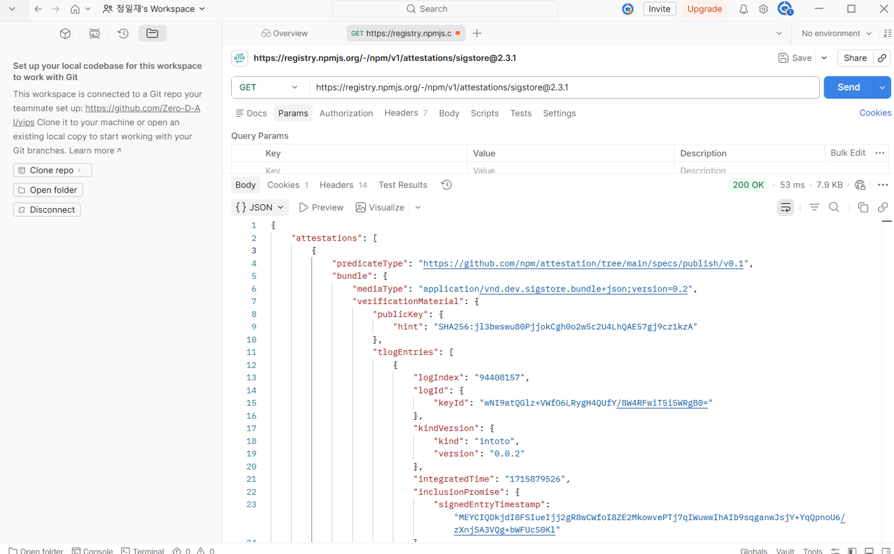
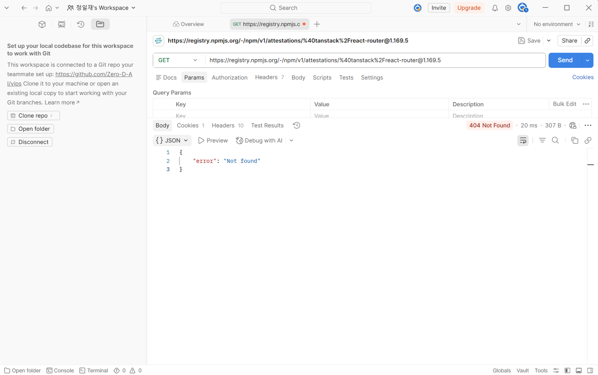
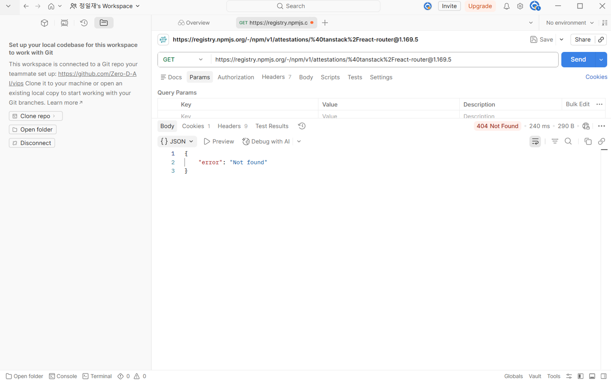
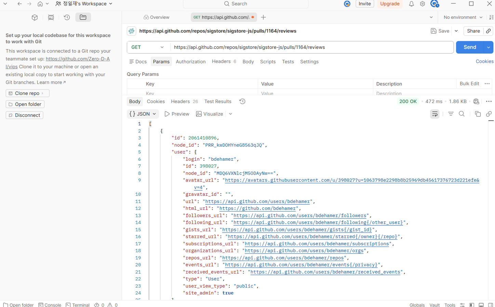
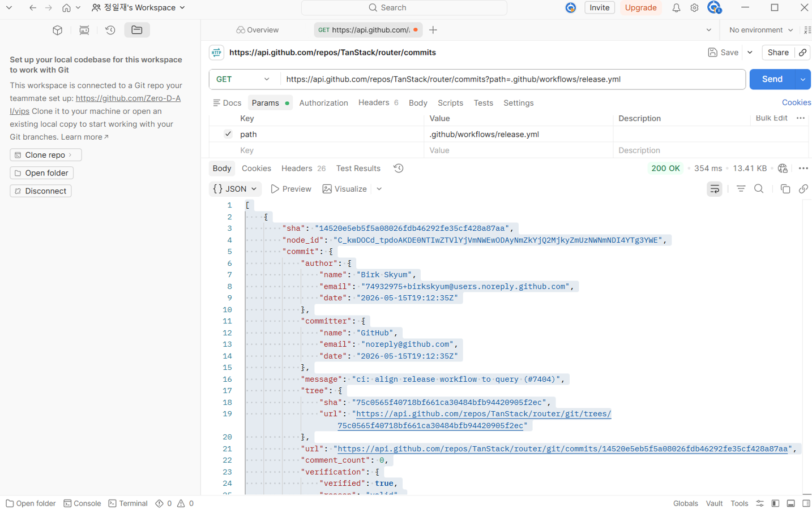

# Spike Report: 외부 패키지 계보 데이터 검증

## 1. 개요

공급망 보안 분석을 위해 외부 패키지의 계보(Provenance) 및 빌드 이력을 공개 API로 추적할 수 있는지 확인하기 위한 기술 검증(Spike)을 수행함.

## 2. 검증 대상

- **정상 패키지**: `sigstore@2.3.1` (Provenance 데이터 포함)
- **침해 패키지**: `@tanstack/react-router@1.169.5` (공급망 공격 사례)

## 3. 항목별 검증 결과 (10개 항목)

| 순번 | 항목              | 대상 레포지토리        | 결과  | 비고                                            |
| :--- | :---------------- | :--------------------- | :---: | :---------------------------------------------- |
| 1    | **Attestation**   | sigstore               | **O** | 정상: SLSA Provenance 데이터 확보 성공          |
| 2    | **Attestation**   | @tanstack/react-router | **X** | 침해: 404 Not Found (데이터 부재)               |
| 3    | **커밋→PR**       | sigstore/sigstore-js   | **O** | PR 번호 및 머지 이력 확인                       |
| 4    | **커밋→PR**       | TanStack/router        | **X** | 악성 커밋에 대응하는 공식 PR 부재               |
| 5    | **PR→리뷰어**     | sigstore/sigstore-js   | **O** | 협업자(Collaborator)의 승인(APPROVED) 확인      |
| 6    | **PR→리뷰어**     | TanStack/router        | **X** | 리뷰 내역 없음 (`[]`)                           |
| 7    | **브랜치 정책**   | sigstore/sigstore-js   | **X** | 데이터 조회 권한 없음 (403/404)                 |
| 8    | **브랜치 정책**   | TanStack/router        | **O** | 승인 정책 확인 (Approving_review_count: 0 발견) |
| 9    | **워크플로 이력** | sigstore/sigstore-js   | **O** | 봇(Dependabot)에 의한 정기적 업데이트 확인      |
| 10   | **워크플로 이력** | TanStack/router        | **O** | CI 설정 파일 변경 이력 확인                     |

## 4. 분석 논리 및 설계 전환

- **기술적 타당성**: 10개 항목 중 7개 항목이 데이터 확보에 성공하여 **GO 판정**을 내림.
- **보안 식별 지표**:
  - 정상 패키지는 **'투명성 로그(Attestation) + 리뷰 승인(PR Reviews) + 봇 자동화(Workflows)'**라는 강력한 보안 파이프라인을 가짐.
  - 침해 패키지는 **'데이터 부재(404) + 리뷰 누락([]) + 허술한 브랜치 보안 정책(0 Approvals)'** 패턴을 보임.
- **설계 전환(Pivot)**: 직접적인 정책 API 조회(항목 7)가 권한 문제로 한계가 있으므로, 향후 개발 시 **'PR 리뷰 API'와 '브랜치 규칙 API'를 복합 분석하여 리뷰 절차가 생략된 머지를 '위험 신호'로 탐지하는 로직으로 구현할 것.**

## 5. 증거 자료 (화면 캡처 10개)

본 실험에서 검증한 10개 항목에 대한 Postman 응답 결과입니다.

- **[Capture 01] Attestation (Sigstore):**
  

- **[Capture 02] Attestation (TanStack):**
  

- **[Capture 03] 커밋→PR (Sigstore):**
  

- **[Capture 04] 커밋→PR (TanStack):**
  

- **[Capture 05] PR→리뷰어 (Sigstore):**
  

- **[Capture 06] PR→리뷰어 (TanStack):**
  

- **[Capture 07] 브랜치 정책 (Sigstore):**
  

- **[Capture 08] 브랜치 정책 (TanStack):**
  

- **[Capture 09] 워크플로 이력 (Sigstore):**
  

- **[Capture 10] 워크플로 이력 (TanStack):**
  

## 6. 결론

본 스파이크를 통해 공개된 API 만으로도 충분히 패키지 공급망의 건전성을 계보적으로 추적 및 식별할 수 있음을 입증함. 확보된 데이터 기반으로 보안 탐지 툴 개발을 착수할 예정?
